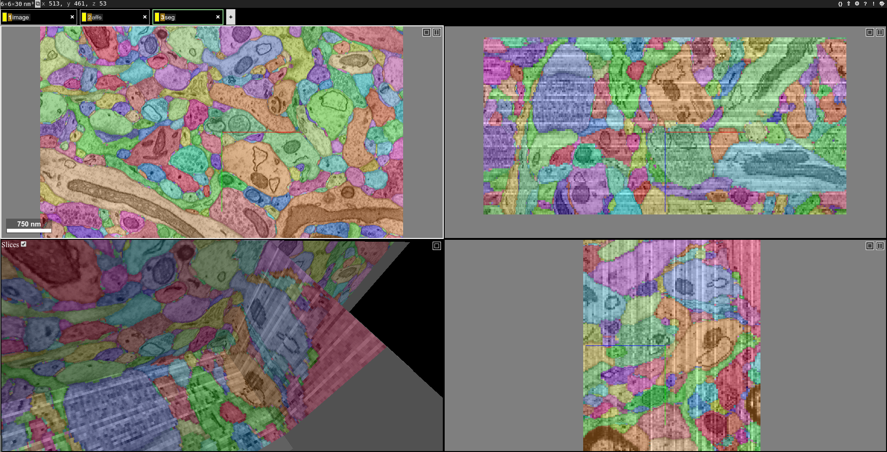
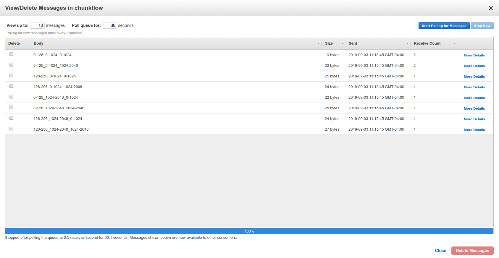
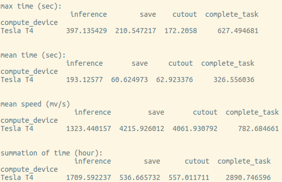

.. _tutorial:

Tutorial
##############

Use Chunkflow as a Python Library
**********************************
Chunkflow is a python library and all the operators can be used a python function. You can start using it with:

.. code-block:: python

   import chunkflow

For the full list of api functions, please checkout the :ref:`api`.

Composable Command Line Interface
*****************************************************************
Chunkflow also provide a composable command line interface. You can compose operators and create your own pipeline flexibly for your specific application. The operators could be reused in different applications.

You can get a list of available operators by::
    
    chunkflow

You'll see a list like this:

|operator_list|

.. |operator_list| image:: _static/image/operator_list.png

We keeps adding more and more operators, you might see more operators than this list. You can get help for each operator by typing ``chunkflow operator --help``, such as::

    chunkflow create-chunk --help

Now let's play with some operators.

Visualization of a Chunk
==========================

CloudVolume Viewer
--------------------------------------
Create a random image volume and visualize it in browser::

    chunkflow create-chunk view

open the link and you should see a image volume in browser:

|random_image_in_cloudvolume_viewer|

.. |random_image_in_cloudvolume_viewer| image:: _static/image/random_image_in_cloudvolume_viewer.png

Neuroglancer
---------------------------------
create a random image volume and show it in neuroglancer::

    chunkflow create-chunk neuroglancer

open the link and you should see it:

|random_image_in_neuroglancer|

.. |random_image_in_neuroglancer| image:: _static/image/random_image_in_neuroglancer.png

Note that the random image center is blacked out.

Input and Output
=================
I/O of Local Image
-------------------
Now let's play with some real data! You can download the data from `CREMI <https://cremi.org/>`_ challenge website. Let's use the `Dataset A <https://cremi.org/static/data/sample_A_20160501.hdf>`_ for now. 

Run this command and open the link in your browser::

   chunkflow read-h5 --file-name sample_A_20160501.hdf --dataset-path /volumes/raw neuroglancer --voxel-size 40 4 4 

Change the file path if you put your image in some other places. You should see the image in neuroglancer:

|cremi_image|

.. |cremi_image| image:: _static/image/cremi_image.png

Cutout/Save a Chunk from Large Scale Volume in Cloud Storage
-------------------------------------------------------------
We use CloudVolume_ to perform cutout/saving of chunks in a large scale volumemetric dataset. To be convenient, we use local file system in this tutorial. To use cloud storage, you can just setup the authentication following the documentation of CloudVolume_ and replace the path to cloud storage. You can create a volume and ingest the image stack to the volume::

   chunkflow read-h5 --file-name sample_A_20160501.hdf --dataset-path /volumes/raw save --volume-path file:///tmp/your/key/path 

Now you can cutout the image chunk from the volume::

   chunkflow cutout --volume-path file:///tmp/your/key/path --start 0 0 0 --stop 128 512 512 write-h5 --file-name /tmp/cutout_chunk.h5

.. _CloudVolume: https://github.com/seung-lab/cloud-volume

Evaluation of Segmentation
==========================
You can read two segmentation volumes and compare them::

   chunkflow read-tif --file-name groundtruth.tif -o gt read-tif --file-name /tmp/segmentation.tif -o seg evaluate-segmentation -g gt -s seg

The result will print out in terminal::

   Rand split: 0.958776
   Rand merge: 0.978602
   VOI split: 0.300484
   VOI merge: 0.143631

Of course, you can replace the ``read-tif`` operator to other reading operators, such as ``read-h5`` and ``cutout``.

Convolutional Network Inference
================================
Given a trained convolution network model, it can process small patches of image and output a map, such as synapse cleft or boundary map. Due to the missing context around patch boundary, we normally need to reweight the patch. We trust the central region more and trust the marginal region less. The ``inference`` operator performs reweighting of patches and blend them together automatically, so the input chunk size can be arbitrary without patch alignment. The only restriction is the RAM size. After blending, the output chunk will looks like a single patch and could be used for further processing.

.. note::
   If there is GPU and cuda available, chunkflow will automatically use GPU for both inference and reweighting.

In order to provide a general interface for broader application, the ConvNet model should be instantiated, called ``InstantiatedModel``, with all of it's parameter setup inside. Chunkflow also provide a interface for customized preprocessing and postprocessing. You can define ``pre_process`` and ``post_process`` function to add your specialized operations. You can also define your own ``load_model`` function, and make some special loading operation, which is useful to load model trained with old version of pytorch (version<=0.4.0). This is an example of code:

.. code-block:: python
   
   def pre_process(input_patch):
      # we do not need to do anything, 
      # just transfer input patch to net
      net_input = input_patch
      return net_input

   def post_process(net_output):                                
      # the net output is a list of 5D tensor, 
      # and there is only one element. 
      output_patch = net_output[0]
      # the output patch is a 5D tensor with dimension of batch, channel, z, y, x
      # there is only one channel, so we drop it.
      # use narrow function to avoid memory copy. 
      output_patch = output_patch.narrow(1, 0, 1)
      # We need to apply sigmoid function to get the softmax result
      output_patch = torch.sigmoid(output_patch)               
      return output_patch                                      
                                                             
   in_dim = 1                                                   
   output_spec = OrderedDict(psd_label=1)
   depth = 3                                                    
   InstantiatedModel = Model(in_dim, output_spec, depth)        

.. note::

   If you do not define the pre_process and post_process function, it will automatically be replaced as identity function and do not do any transformation.

Synaptic Cleft Detection
------------------------
With only one command, you can perform the inference to produce cleft map and visualize it::

   chunkflow read-tif -f path/of/image.tif -o image inference --convnet-model model.py --convnet-weight-path weight.chkpt --patch-size 18 192 192 --patch-overlap 4 64 64 --framework pytorch --batch-size 6 --bump wu --num-output-channels 1 --mask-output-chunk -i image -o cleft write-tif -i cleft -f cleft.tif neuroglancer -c image,cleft -p 33333 -v 30 6 6

You can see the image with output synapse cleft map:

|cleft|

.. |cleft| image:: _static/image/cleft.png

You can also apply a threshold to get a segmentation of the cleft map::

   chunkflow read-tif -f path/of/image.tif -o image read-tif -f cleft.tif -o cleft connected-components -i cleft -o seg -t 0.1 neuroglancer -p 33333 -c image,seg -v 30 6 6

You should see segmentation overlayed with image:

|cleft_label|

.. |cleft_label| image:: _static/image/cleft_label.png

Of course, you can add a writing operator, such as ``write-tif``, before the ``neuroglancer`` operator to save the segmentation.

Dense Neuron Segmentation
-------------------------

We used a ConvNet trained using SNEMI3D_ dataset, you can download the data from the website. Then, we can perform boundary detection with one single command:: 

    chunkflow read-tif --file-name path/of/image.tif -o image inference --convnet-model path/of/model.py --convnet-weight-path path/of/weight.pt --patch-size 20 256 256 --patch-overlap 4 64 64 --num-output-channels 3 -f pytorch --batch-size 12 --mask-output-chunk -i image -o affs write-h5 -i affs --file-name affs.h5 neuroglancer -c image,affs -p 33333 -v 30 6 6

.. _SNEMI3D: http://brainiac2.mit.edu/SNEMI3D/home

|image_aff|

.. |image_aff| image:: _static/image/image_aff.png

The boundary map is also saved in ``affs.h5`` file and could be used in later processing. The affinitymap array axis is ``channel,z,y,x``, and the channel order is ``x,y,z`` for our model output, meaning the first channel is ``x`` direction. 

You can perform mean affinity segmentation with one single command::

   chunkflow read-h5 --file-name affs.h5 -o affs agglomerate --threshold 0.7 --aff-threshold-low 0.001 --aff-threshold-high 0.9999 -i affs -o seg write-tif -i seg -f seg.tif read-tif --file-name image.tif -o image neuroglancer -c image,affs,seg -p 33333 -v 30 6 6

You should be able to see the image, affinity map and segmentation in neuroglancer. Overlay the segmentation with the image looks like this:

|image_seg|

If the computation takes too long, you can decrease the ``aff-threshold-high`` to create bigger supervoxels or decrease the ``threshold`` to merge less watershed domains.

Of course, you can also combine the two setups to one single command::
    
    chunkflow read-tif --file-name path/of/image.tif -o image inference --convnet-model path/of/model.py --convnet-weight-path path/of/weight.pt --patch-size 20 256 256 --patch-overlap 4 64 64 --num-output-channels 3 -f pytorch --batch-size 12 --mask-output-chunk -i image -o affs write-h5 -i affs --file-name affs.h5 agglomerate --threshold 0.7 --aff-threshold-low 0.001 --aff-threshold-high 0.9999 -i affs -o seg write-tif -i seg -f seg.tif neuroglancer -c image,affs,seg -p 33333 -v 30 6 6

Distributed Computation in both Local and Cloud
*************************************************
We use AWS SQS_ queue to decouple task producing and managing frontend and the computational heavy backend. In the frontend, you can produce a bunch of tasks to AWS SQS queue, and the tasks are managed in AWS SQS. Then, you can launch any number of chunkflow workers in **both** local and cloud. You can even mix using multiple cloud instances. Actually, you can use **any** computer with internet connection and AWS authentication **at the same time**. This hybrid cloud architecture enables maximum computational resources usage.

.. _SQS: https://aws.amazon.com/sqs/

Build Docker Image
==================
It is recommended to use Docker_ image for deployment in both local and cloud. Docker image contains all the computational environments for chunkflow and ensures that the operations are all consistent.

All the docker images are automatically built and is available in the DockerHub_. The ``latest`` tag is the image built from the ``master`` branch. The ``base`` tag is a base ubuntu image, and the ``pytorch`` and ``pznet`` tag contains ``pytorch`` and ``pznet`` inference backends respectively. 

.. _DockerHub: https://hub.docker.com/r/seunglab/chunkflow
.. _Docker: https://www.docker.com/

You can also manually build docker images locally. The docker files is organized hierarchically. The ``docker/base/Dockerfile`` is a basic one, and the ``docker/inference/pytorch/Dockerfile`` and ``docker/inference/pznet/Dockerfile`` contains pytorch and pznet respectively for ConvNet inference. 

After building the base images, you can start building chunkflow image with different backends. You can just modify the base choice in the Dockerfile and then build it:

.. code-block:: docker

    # backend: base | pytorch | pznet | pytorch-cuda9
    ARG BACKEND=pytorch 

Produce Tasks and Ingest to AWS SQS Queue
=========================================
You can use the ``generate-tasks`` to generate tasks. It will ingest the tasks to a AWS SQS_ queue if you define the ``queue-name`` parameter::
   
   chunkflow generate-tasks --chunk-size 128 1024 1024 --grid-size 2 2 2 --stride 128 1024 1024 --queue-name chunkflow

Log in your AWS console, and check the ``chunkflow`` queue, you should see your tasks there like this:

|tasks_in_sqs|

Chunkflow also provide a smart way to produce tasks using the existing dataset information. If we would like to process the whole dataset, we only need to define the mip level, and chunk size, all other parameters could be automatically computed based on the dataset information, such as volume start offset and shape. This is a simple example::

   chunkflow generate-tasks -l gs://my/dataset/path -m 0 -o 0 0 0 -c 112 2048 2048 -q my-queue

Deploy in Local Computers
===========================
You can fetch the task from SQS queue, and perform the computation locally. You can compose the operations to create your pipeline. 

Here is a simple example to downsample the dataset with multiple resolutions::

   chunkflow --mip 0 fetch-task -q my-queue cutout -v gs://my/dataset/path -m 0 --fill-missing downsample-upload -v gs://my/dataset/path --start-mip 1 --stop-mip 5 delete-task-in-queue

Here is an example to generate meshes from segmentation in mip 3::

   chunkflow --mip 3 fetch-task -q zfish -v 600 cutout -v gs://neuroglancer/zfish_v1/consensus-20190923 --fill-missing mesh --voxel-size 45 5 5 -o gs://neuroglancer/zfish_v1/consensus-20190923 --dust-threshold 100

.. note:: This command will generate meshes for all the objects in segmentation volume. You can also specify selected segmentation using the `--ids` parameter. We normally call it sparse meshing.

Here is a complex example to perform convolutional inference::

   chunkflow --verbose --mip 2 fetch-task --queue-name=my-queue --visibility-timeout=3600 cutout --volume-path="s3://my/image/volume/path --expand-margin-size 10 128 128 --fill-missing inference --convnet-model=my-model-name --convnet-weight-path="/nets/weight.pt" --patch-size 20 256 256 --patch-overlap 10 128 128 --framework='pytorch' --batch-size=8 save --volume-path="file://my/output/volume/path" --upload-log --nproc 0 --create-thumbnail cloud-watch delete-task-in-queue
  
With a local cluster, you can also use your cluster scheduler to run multiple processes and perform distributed computation.

Deploy to Kubernetes Cluster in Cloud
======================================
Kubernetes_ is the most popular docker container orchestration platform, and is supported in most of public cloud computing platforms, including AWS, Google Cloud, and Microsoft Azure. You can use our `template
<https://github.com/seung-lab/chunkflow/blob/master/distributed/kubernetes/deploy.yml>`_ to deploy chunkflow to your Kubernetes cluster. Just replace the composed command you would like to use in the yaml file. For creating cluster in cloud and usage, please check our `wikipedia page
<https://github.com/seung-lab/chunkflow/wiki/Kubernetes-in-Cloud>`_. You can checkout the `Kubernetes documentation
<https://kubernetes.io>`_ for more detailed usage. 

Performance Analysis
=====================
You can use ``log-summary`` to give a brief summary of operator performance::

   chunkflow log-summary --log-dir /tmp/log --output-size 156 1280 1280

You should see the summary like this:

|log_summary|

