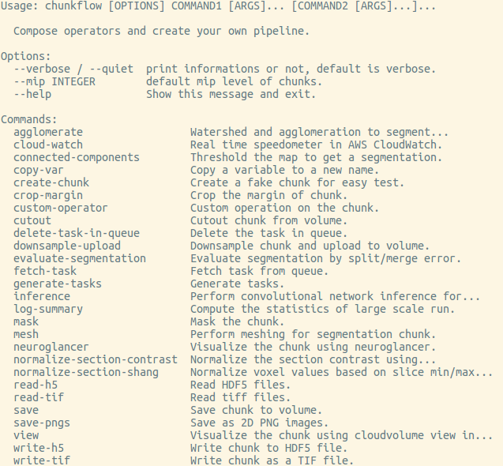
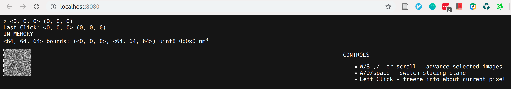
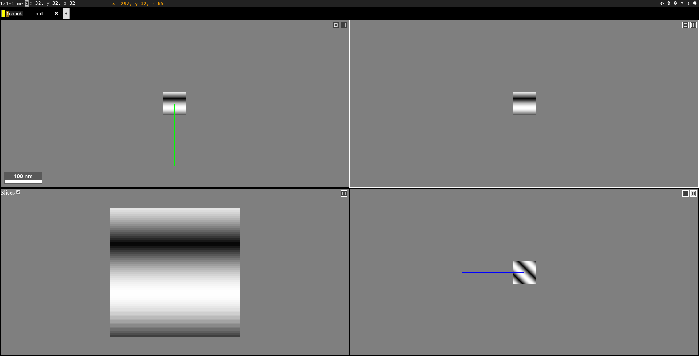
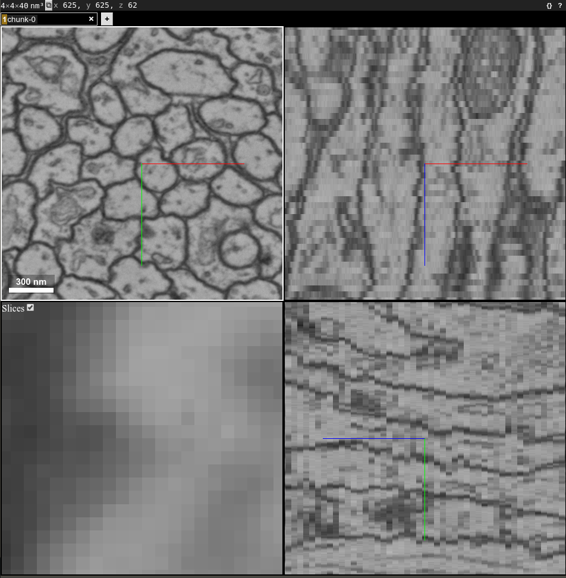
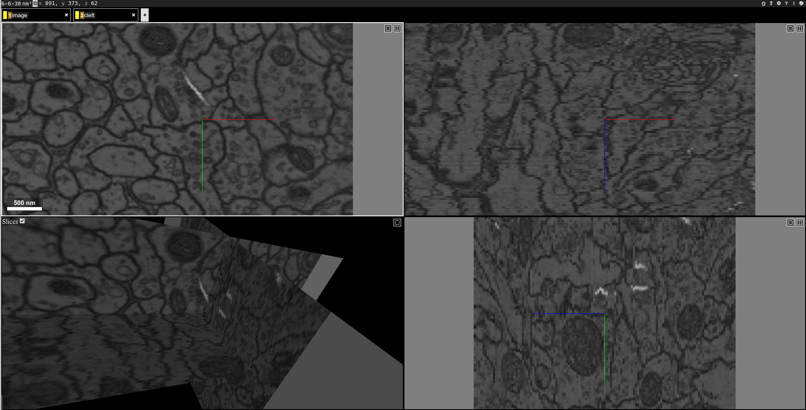
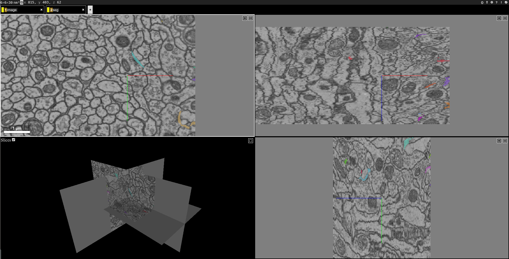
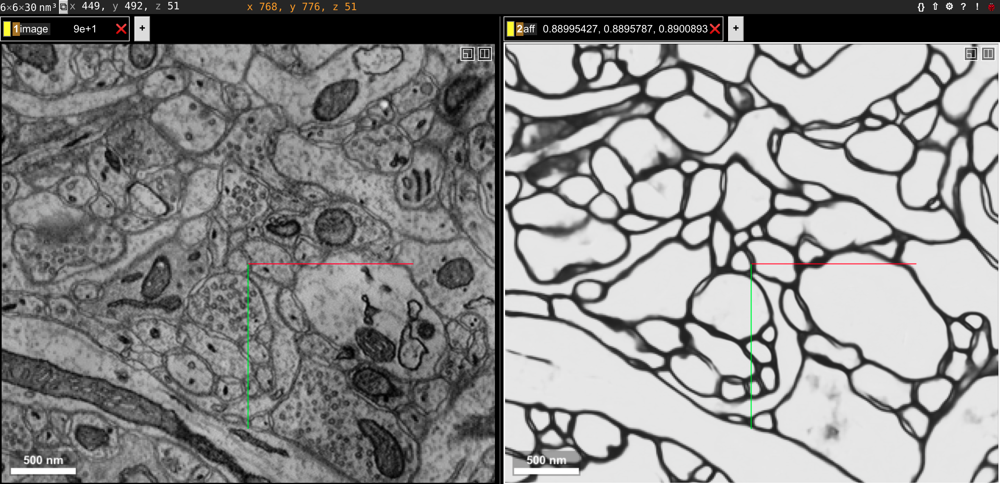

.. _tutorial:

Tutorial
##############

Composable Commandline Interface
*********************************
You can compose operators and create your own pipeline flexibly. The operators could be reused in different applications.

You can get a list of available operators by::
    
    chunkflow

You'll see a list like this:

|operator_list|

We keeps adding more and more operators, you might see more operators than this list. You can get help for each operator by typing ``chunkflow operator --help``, such as::

    chunkflow create-chunk --help

Visualization of a Chunk
==========================

CloudVolume Viewer
--------------------------------------
Create a random image volume and visualize it in browser::

    chunkflow create-chunk view

open the link and you should see a image volume in browser:

|random_image_in_cloudvolume_viewer|

Neuroglancer
---------------------------------
create a random image volume and show it in neuroglancer::

    chunkflow create-chunk neuroglancer

open the link and you should see it:

|random_image_in_neuroglancer|

Note that the random image center is blacked out.

Input and Output
=================
I/O of Local Image
-------------------
Now let's play with some real data! You can download the data from `CREMI <https://cremi.org/>`_ challenge website. Let's use the `Dataset A <https://cremi.org/static/data/sample_A_20160501.hdf>`_ for now. 

Run this command and open the link in your browser::

   chunkflow read-h5 --file-name sample_A_20160501.hdf --dataset-path /volumes/raw neuroglancer --voxel-size 40 4 4 

Change the file path if you put your image in some other places. You should see the image in neuroglancer:

|cremi_image|

Cutout/Save a Chunk from Large Scale Volume in Cloud Storage
-------------------------------------------------------------
We use CloudVolume_ to perform cutout/saving of chunks in a large scale volumemetric dataset. To be convenient, we use local file system in this tutorial. To use cloud storage, you can just setup the authentication following the documentation of CloudVolume_ and replace the path to cloud storage. You can create a volume and ingest the image stack to the volume::

   chunkflow read-h5 --file-name sample_A_20160501.hdf --dataset-path /volumes/raw save --volume-path file:///tmp/your/key/path 

Now you can cutout the image chunk from the volume::

   chunkflow cutout --volume-path file:///tmp/your/key/path --start 0 0 0 --stop 128 512 512 write-h5 --file-name /tmp/cutout_chunk.h5

.. _CloudVolume: https://github.com/seung-lab/cloud-volume

Evaluation of Segmentation
==========================
You can read two segmentation volumes and compare them::

   chunkflow read-tif --file-name groundtruth.tif -o gt read-tif --file-name /tmp/segmentation.tif -o seg evaluate-segmentation -g gt -s seg

The result will print out in terminal::

   Rand split: 0.958776
   Rand merge: 0.978602
   VOI split: 0.300484
   VOI merge: 0.143631

Of course, you can replace the ``read-tif`` operator to other reading operators, such as ``read-h5`` and ``cutout``.

Convolutional Network Inference
================================
Given a trained convolution network model, it can process small patches of image and output a map, such as synapse cleft or boundary map. Due to the missing context around patch boundary, we normally need to reweight the patch. We trust the central region more and trust the marginal region less. The ``inference`` operator performs reweighting of patches and blend them together automatically, so the input chunk size can be arbitrary without patch alignment. The only restriction is the RAM size. After blending, the output chunk will looks like a single patch and could be used for further processing.

.. note::
   If there is GPU and cuda available, chunkflow will automatically use GPU for both inference and reweighting.

In order to provide a general interface for broader application, the ConvNet model should be instantiated, called ``InstantiatedModel``, with all of it's parameter setup inside. Chunkflow also provide a interface for customized preprocessing and postprocessing. You can define ``pre_process`` and ``post_process`` function to add your specialized operations. This is an example of code:

.. code-block:: python
   
   def pre_process(input_patch):
      # we do not need to do anything, 
      # just transfer input patch to net
      net_input = input_patch
      return net_input

   def post_process(net_output):                                
      # the net output is a list of 5D tensor, 
      # and there is only one element. 
      output_patch = net_output[0]
      # the output patch is a 5D tensor with dimension of batch, channel, z, y, x
      # there is only one channel, so we drop it.
      # use narrow function to avoid memory copy. 
      output_patch = output_patch.narrow(1, 0, 1)
      # We need to apply sigmoid function to get the softmax result
      output_patch = torch.sigmoid(output_patch)               
      return output_patch                                      
                                                             
   in_dim = 1                                                   
   output_spec = OrderedDict(psd_label=1)
   depth = 3                                                    
   InstantiatedModel = Model(in_dim, output_spec, depth)        

.. note::

   If you do not define the pre_process and post_process function, it will automatically be replaced as identity function and do not do any transformation.

Synaptic Cleft Detection
------------------------
With only one command, you can perform the inference to produce cleft map and visualize it::

   chunkflow read-tif -f path/of/image.tif -o image inference --convnet-model model.py --convnet-weight-path weight.chkpt --patch-size 18 192 192 --patch-overlap 4 64 64 --framework pytorch --batch-size 6 --bump wu --num-output-channels 1 --mask-output-chunk -i image -o cleft write-tif -i cleft -f cleft.tif neuroglancer -c image,cleft -p 33333 -v 30 6 6

You can see the image with output synapse cleft map:

|cleft|

You can also apply a threshold to get a segmentation of the cleft map::

   chunkflow read-tif -f path/of/image.tif -o image read-tif -f cleft.tif -o cleft connected-components -i cleft -o seg -t 0.1 neuroglancer -p 33333 -c image,seg -v 30 6 6

You should see segmentation overlayed with image:

|cleft_label|

Of course, you can add a writing operator, such as ``write-tif``, before the ``neuroglancer`` operator to save the segmentation.

Dense Neuron Segmentation
-------------------------
With a boundary detection network, we can perform boundary detection with one single command:: 

    chunkflow read-tif --file-name path/of/image.tif -o image inference --convnet-model path/of/model.py --convnet-weight-path path/of/weight.pt --patch-size 20 256 256 --patch-overlap 4 64 64 --num-output-channels 3 -f pytorch --batch-size 12 --mask-output-chunk -i image -o aff write-h5 -i aff --file-name aff.h5 neuroglancer -c image,aff -p 33333 -v 30 6 6

|image_aff|

The boundary map is also saved in ``aff.h5`` file and could be used in later processing.

Distributed Computation
************************

Deploy in Local Computers
===========================

Deploy to Kubernetes Cluster in Cloud
======================================
