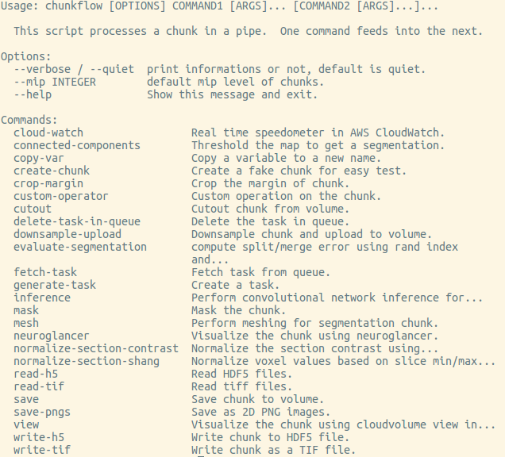
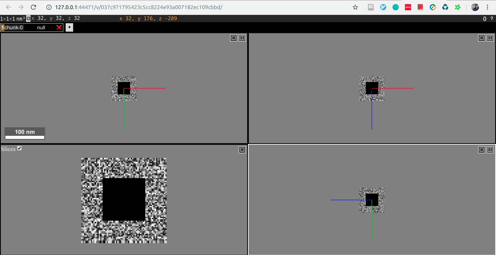

.. _tutorial:

Tutorial
##############

Composable Commandline Interface
*********************************
You can compose operators and create your own pipeline flexibly. The operators could be reused in different applications.

You can get a list of available operators by::
    
    chunkflow

You'll see a list like this:

|operator_list|

We keeps adding more and more operators, you might see more operators than this list. You can get help for each operator by typing `chunkflow operator --help`, such as::

    chunkflow create-chunk --help

Visualization of a Chunk
==========================

CloudVolume Viewer
--------------------------------------
Create a random image volume and visualize it in browser::

    chunkflow create-chunk view

open the link and you should see a image volume in browser:

|random_image_in_cloudvolume_viewer|

.. |random_image_in_cloudvolume_viewer| image:: _static/image/random_image_in_cloudvolume_viewer.png
    :width: 600

Neuroglancer
---------------------------------
create a random image volume and show it in neuroglancer::

    chunkflow create-chunk neuroglancer

open the link and you should see it:

|random_image_in_neuroglancer|

Note that the random image center is blacked out.

Input and Output
=================

Now let's do some 

Convolutional Network Inference
================================

Distributed Computation
************************

Deploy in Local Computers
===========================

Deploy to Kubernetes Cluster in Cloud
======================================
